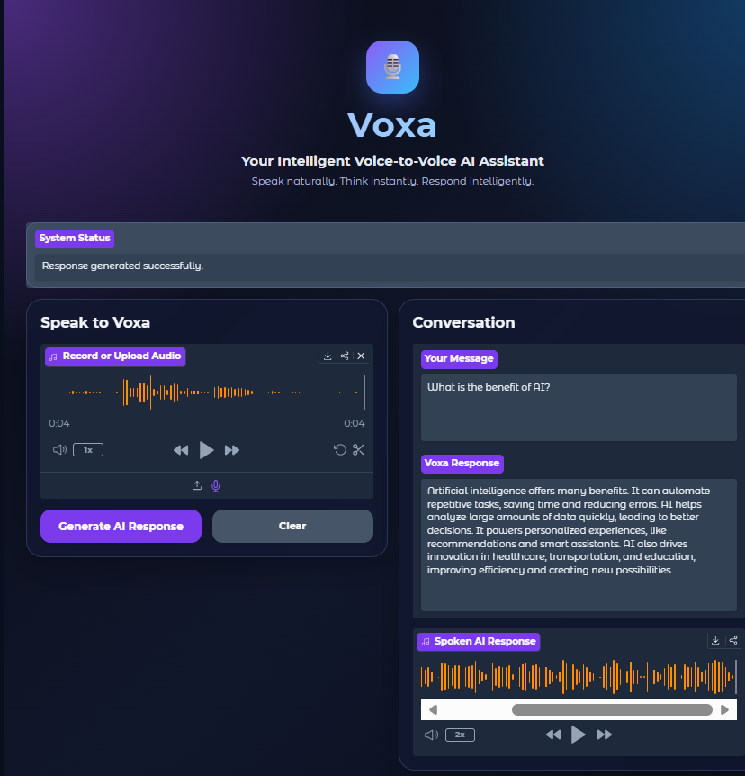

# 🎙️ Voxa Voice Assistant

## Overview

Voxa is a bilingual Voice-to-Voice AI Assistant that allows users to communicate naturally using their voice.

The system converts spoken input into text, generates an intelligent response using a Large Language Model (Cohere), and converts the response back into speech.

## Project Workflow

```
User Voice
    ↓
Speech-to-Text
(Faster-Whisper)
    ↓
Text Processing
(Cohere LLM)
    ↓
AI Response
    ↓
Text-to-Speech
(gTTS)
    ↓
Voice Output
```

## Features

- 🎤 Real-time voice input using microphone
- 📝 Speech recognition using Faster-Whisper
- 🤖 Intelligent responses using Cohere AI
- 🔊 Text-to-Speech voice generation
- 🌐 Supports Arabic and English languages
- ✨ Modern interactive user interface using Gradio

## Technologies Used

| Technology | Purpose |
|---|---|
| Python | Programming language |
| Gradio | User interface |
| Faster-Whisper | Speech-to-Text |
| Cohere API | AI response generation |
| gTTS | Text-to-Speech |
| GitHub | Project hosting |

## Project Structure

```
Voxa-Voice-Assistant/
│
├── app.py
├── speech_to_text.py
├── llm_service.py
├── text_to_speech.py
├── requirements.txt
├── .env.example
├── README.md
│
├── assets/
│   └── output.png
│
└── demo/
    └── test.mp4
```

## Installation

### 1. Clone the repository

```bash
git clone https://github.com/Raghadksa/Voxa-Voice-Assistant.git
```

### 2. Create environment

```bash
conda create -n voice-assistant python=3.11
```

Activate environment:

```bash
conda activate voice-assistant
```

### 3. Install dependencies

```bash
pip install -r requirements.txt
```

## API Configuration

Create a file named:

```
.env
```

Add your Cohere API key:

```env
COHERE_API_KEY=your_api_key_here
```

## Run the Application

```bash
python app.py
```

The application will open in your browser.

## Interface Preview



## Demo

Watch the demo video:

[test.mp4](Test.zip)

## Future Improvements

- Add conversation history
- Improve voice response quality
- Add user authentication
- Deploy as a web application

## Author

**Raghad Alhamad**

